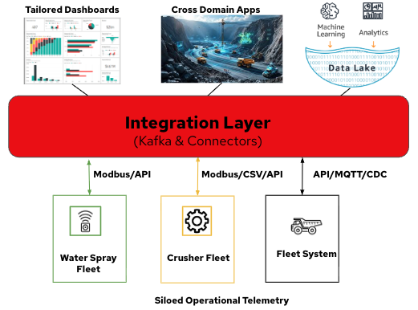

# Mining fleet demo — three plant systems

> **Repository role:** This repo (**Operational Technology Integration Platform / OTIP**) is the single home for **design documentation**, **PoC application code** (`poc/`), and **OpenShift manifests** (`openshift/`) for the mining fleet demo on OpenShift.

This document describes a **Fleet Management System** demonstration built on **OpenShift / ROSA**. The demo models a small open-pit mine as **three independent operational systems**, each running in its own Kubernetes namespace as a **closed ecosystem**. A shared **Apache Kafka** cluster (**Red Hat AMQ Streams** on OpenShift) connects them in a second phase.

The goal is a credible story for stakeholders:

- **Mobile fleet** (haul trucks) — wireless-style telemetry and operational state.
- **Fixed plant** (crushers) — wired automation, local historian, batch export to object storage.
- **Environmental / dust control** (water sprays) — field PLCs commanded by site events.

Each system can be developed, deployed, and demonstrated **on its own**. Integration is explicit and crosses only well-defined boundaries (Kafka topics, S3 objects, or optional bridges into a fleet database).

---

## At a glance

The demo stacks three layers: **siloed operational telemetry** at the plant edge (each fleet in its own namespace), an **integration layer** built on **Apache Kafka** and connectors (**Red Hat AMQ Streams** on OpenShift), and **consumption** through tailored dashboards, cross-domain applications, and a data lake for advanced processing (ML, analytics).

<p align="center">
  
</p>

*Bottom — siloed operational telemetry:* Water Spray Fleet (Modbus/API), Crusher Fleet (Modbus/CSV/API), and Fleet System (API/MQTT/CDC). *Middle — integration layer:* Kafka and connectors (Debezium CDC, Modbus bridges, S3 pollers). *Top — consumption:* tailored dashboards, cross-domain apps, and data lake / advanced processing.

| System | Namespace (planned) | Field protocol | In-namespace data store | Primary northbound handoff |
|--------|---------------------|----------------|-------------------------|----------------------------|
| **Haul trucks** | `truck-fleet` | MQTT (pub/sub per truck) | PostgreSQL | Operational UI, assignment, metrics |
| **Crushers** | `crusher-fleet` | Modbus TCP (per crusher PLC) | Plant historian (time-series DB) | CSV files in **AWS S3** |
| **Water sprays** | `water-spray-fleet` | Modbus TCP (north + south PLC pods) | PLC registers (state on device) | Commands via Modbus (from Kafka in phase 2) |

---

## Design principles

1. **Closed namespaces** — Each ecosystem contains its own workloads, services, and persistence. Other systems do not reach into its Postgres or Modbus ports directly.
2. **Industry-shaped protocols** — Trucks use **MQTT** (common for mobile / edge). Crushers and sprays use **Modbus TCP** (common for fixed plant PLCs). PLCs do not write to PostgreSQL; integration services do.
3. **Different speeds** — Trucks update often (position, route). Crushers change slowly (fill level, full/empty). Sprays are actuators (on/off) driven by **events**, not high-frequency telemetry.
4. **Kafka as the site bus (phase 2)** — After stand-alone demos work, Kafka carries **domain events** and **commands** between ecosystems. Crushers may still archive to S3 in parallel; that is not the real-time path for sprays.

---

## Repository layout

This repository (**OTIP**) holds **design documentation**, **PoC application code**, and **OpenShift manifests** for the mining fleet demo. Folders such as [`truck-fleet/`](truck-fleet/), [`crusher-fleet/`](crusher-fleet/), [`water-spray-fleet/`](water-spray-fleet/), and [`fleet-integration/`](fleet-integration/) contain per-system design notes, architecture diagrams, and runbooks.

| Path | Purpose |
|------|---------|
| [`poc/`](poc/) | Source code for the demo applications — truck agents, MQTT ingest, crusher PLCs, historian, Kafka bridges, live map, and related services |
| [`openshift/`](openshift/) | Kubernetes / OpenShift YAML — namespaces, Deployments, BuildConfigs, Kafka topics, connectors, and other cluster artefacts |

Each `poc/` and `openshift/` subdirectory is named after its fleet namespace (e.g. `truck-fleet`, `crusher-fleet`, `fleet-integration`, `mining-fleet-kafka`, `fleet-live-map`).

---

## 1. Haul trucks (`truck-fleet`)

### Role in the mine

Haul trucks move material between the **loading area** and **crusher bays** (north and south). The demo script typically runs a small fleet (e.g. three trucks) with sequential or coordinated dumping so operators can see routing, bay fill, and exceptions on a live map.

### Architecture (stand-alone)

```text
┌──────────────┐                        ┌─────────────┐                        ┌─────────────┐
│  truck-TR1   │ ─ (telemetry) ────────►│ MQTT broker │ ─ (telemetry) ────────►│ mqtt-ingest │
│  (Pod)       │◄─ (reroute, stop,      │  (in ns)    │                        │  service    │
│              │    assign) ────────────│             │                        └──────┬──────┘
│  truck-TR2   │ ─ (telemetry) ────────►│             │                               │
│  truck-TR3   │ ─ (telemetry) ────────►│             │                               │ SQL
└──────────────┘                        └─────────────┘                               │
                                                                                      ▼
                                                                             ┌─────────────┐
                                                                             │  PostgreSQL │
                                                                             │   (in ns)   │
                                                                             └─────────────┘
                                                                                      │
                                                                                      ▼
                                                                           Live map / Grafana
                                                                          (reads DB, not MQTT)
```

### Behaviour

- **One Pod per truck** (or per truck agent) publishes telemetry: position, speed, payload state, current assignment, status.
- Trucks **subscribe** to command topics (reroute, stop, new destination) issued by assignment logic or a demo orchestrator.
- **`mqtt-ingest`** consumes MQTT messages and **writes normalized rows** into PostgreSQL. The database is the **system of record** for the fleet UI.
- **PostgreSQL does not subscribe to MQTT**; only the ingest service bridges the bus to SQL.

### Typical data in Postgres

- Truck state (location, payload, status, assigned route)
- Route and assignment tables
- Position history / trails for the live map
- Crusher bay summary tables (e.g. `overload_bays` fill %) when a bridge or orchestrator updates them for a unified view

### Stand-alone demo modes

| Mode | Description |
|------|-------------|
| **Scripted orchestrator** | A single service writes Postgres directly to tell a deterministic story (fastest for UI demos). |
| **MQTT agents** | Truck Pods publish/subscribe on MQTT; ingest fills Postgres — closer to production edge architecture. |

### Namespace boundary

Everything required to run trucks (broker, ingest, DB, truck deployments) lives in **`truck-fleet`**. External consumers should use **SQL APIs**, HTTP gateways, or **Kafka** (phase 2), not raw MQTT from outside the namespace.

---

## 2. Crushers (`crusher-fleet`)

### Role in the mine

**Crusher North** and **Crusher South** are fixed plant assets. They accept truck dumps, track fill level, and signal full / accepting / fault states. In the demo narrative, when one bay fills, trucks are re-routed to the other bay.

### Architecture (stand-alone)

```text
┌────────────────────┐         ┌────────────────────┐
│ crusher-north-plc  │         │ crusher-south-plc  │
│   (Pod, Modbus)    │         │   (Pod, Modbus)    │
└─────────┬──────────┘         └─────────┬──────────┘
          │ Modbus poll                  │ Modbus poll
          └──────────────┬───────────────┘
                         ▼
                 ┌───────────────┐
                 │ plant-collector│  reads registers, detects changes
                 └───────┬───────┘
                         │ SQL insert
                         ▼
                 ┌───────────────┐
                 │ plant-historian│  time-series (TimescaleDB or Postgres)
                 └───────┬───────┘
                         │ periodic export
                         ▼
                 ┌───────────────┐
                 │ historian-export│  builds CSV for a time window
                 └───────┬───────┘
                         │ PutObject
                         ▼
                 ┌───────────────┐
                 │   AWS S3      │  s3://…/crusher-fleet/exports/…
                 └───────────────┘
```

### Behaviour

- Each crusher is a **Modbus TCP server** (PLC simulator Pod) exposing holding registers, for example:
  - Fill percentage
  - Status (empty / accepting / full / fault)
  - Dump count, ready flags
- **`plant-collector`** polls Modbus on an interval (e.g. 1–5 s), writes samples to the **historian**, and can emit **change events** when registers cross thresholds (for Kafka in phase 2).
- The **historian** stores high-volume time-series **inside the namespace**. This mimics a site historian (AVEVA PI–style) without claiming a specific vendor product.
- **`historian-export`** rolls up recent samples into a **CSV file** and uploads to **S3** on a schedule. This mimics batch reporting, compliance exports, and offline analysis — not sub-second fleet control.

### Namespace boundary

Modbus and historian access stay inside **`crusher-fleet`**. Other systems learn crusher state via **S3 objects**, **Kafka events** (phase 2), or a thin **bridge** that copies latest fill % into truck-fleet Postgres for a unified map.

---

## 3. Water sprays (`water-spray-fleet`)

### Role in the mine

**Water spray North** and **Water spray South** are dust-suppression zones. They are **actuators**: typically **off** until site logic decides to turn them **on** (e.g. truck on a haul road, material dumped at a crusher, crusher full).

### Architecture (stand-alone)

```text
┌─────────────────────────┐     ┌─────────────────────────┐
│ water-spray-north-plc   │     │ water-spray-south-plc   │
│   (Pod, Modbus server)  │     │   (Pod, Modbus server)  │
└───────────▲─────────────┘     └───────────▲─────────────┘
            │ Modbus write                  │ Modbus write
            │ (on/off, auto)                │
     ┌──────┴───────────────────────────────┴──────┐
     │  kafka-to-spray-modbus  (phase 2)           │
     │  or manual / test Modbus client (phase 1)   │
     └─────────────────────────────────────────────┘
```

### Behaviour

- Each spray is a **Pod representing a field PLC** — it **only speaks Modbus** (holding registers for spray on/off, pressure/flow, fault).
- In **phase 1**, you can prove the namespace by writing registers with a test client or a small simulator.
- In **phase 2**, a **Kafka → Modbus bridge** consumes **`fleet.sprays.commands`** and writes the appropriate PLC registers.
- A **`spray-controller`** (optional Pod) subscribes to **truck** and **crusher** Kafka topics, applies rules (which zone, how long, debounce), and publishes spray commands. The PLCs themselves remain dumb devices.

### Example control rules (phase 2)

| Event source | Example event | Spray action |
|--------------|---------------|--------------|
| `fleet.crushers.events` | `dump_received` @ North | North spray **ON** for N seconds |
| `fleet.crushers.events` | `crusher_full` @ North | North spray **ON** until accepting again |
| `fleet.trucks.events` | `entered_zone` = north haul road | North spray **ON** |
| `fleet.trucks.events` | `left_zone` | North spray **OFF** (or timed off) |

South spray follows the same pattern with south crusher / south zone events.

### Namespace boundary

**`water-spray-fleet`** contains only spray PLCs and spray-specific bridges/controllers. It does **not** host the MQTT broker or crusher historian. Triggers arrive via **Kafka** (or manual Modbus during bench testing).

---

## Phase 2 — Kafka integration (overview)

Once each ecosystem runs stand-alone, deploy a **Kafka** cluster with **Red Hat AMQ Streams** (see [`openshift/mining-fleet-kafka/`](openshift/mining-fleet-kafka/) and [`openshift/fleet-integration/`](openshift/fleet-integration/) for topic wiring and manifests). Integration uses **three complementary patterns**:

```text
truck-fleet (unchanged)          crusher-fleet (unchanged)        water-spray-fleet (unchanged)
  MQTT telemetry                    Modbus/API → own store           Modbus → own store
  mqtt-ingest → PostgreSQL          → Kafka (future)                 → Kafka (future)
       ↓ CDC/ETL                          ↓
       └──────────────→  fleet-integration / Kafka (AMQ Streams)  ←────────┘
                              ↓
                    destination-router
                    consumes: fleet.trucks.telemetry, fleet.crushers.state
                    produces: fleet.routing.commands
                              ↓
                    mqtt-routing-bridge
                    consumes fleet.routing.commands → MQTT new-destination/{truck}/{crusher}
```

**Routing intelligence lives in `fleet-integration`** — not inside truck-fleet or crusher-fleet. Crushers do **not** talk MQTT. Trucks bootstrap from `DEFAULT_CRUSHER` only; runtime rerouting comes from the orchestration layer.

See **[fleet-integration/README.md](fleet-integration/README.md)** for topic contracts, deployment, and the Phase 1 demo path (`kafka-truck-bridge`, mock crusher state).

### Integration mechanisms

| Mechanism | Source | What it carries | Typical use |
|-----------|--------|-----------------|-------------|
| **CDC** | `truck-fleet` PostgreSQL | Row changes on trucks, routes, assignments | Downstream analytics, spray rules, audit |
| **S3 API** | `crusher-fleet` CSV objects | Historian export files | Batch ingest, replay, external reporting; optional Kafka producer on new object |
| **Modbus bridges** | Crusher & spray PLCs | Live register reads / writes | `collector → Kafka` (telemetry/events); `Kafka → Modbus` (spray commands) |

### Suggested Kafka topic prefix

Use a single prefix for clarity, e.g. `fleet.*`:

| Topic | Direction | Content |
|-------|-----------|---------|
| `fleet.trucks.telemetry` | Produce from kafka-truck-bridge or CDC | Position, payload, status, destination |
| `fleet.trucks.events` | Produce from trucks / ingest | `entered_zone`, `dump_started`, `rerouted`, … |
| `fleet.crushers.state` | Produce from plant-collector or demo producer | Periodic fill %, status, at_capacity |
| `fleet.crushers.events` | Produce from plant-collector | `crusher_full`, `dump_received`, `fault`, … |
| `fleet.routing.commands` | Produce from destination-router; consume by mqtt-routing-bridge | `{ truck_id, crusher_name, reason, decided_at }` |
| `fleet.sprays.commands` | Consume by kafka-to-spray-modbus | `{ zone: north\|south, action: on\|off, reason }` |
| `fleet.sprays.status` | Produce from Modbus poll | Spray on, pressure, fault |

Partition keys: `truck_id`, `crusher_id`, `zone_id` where ordering matters.

### Unified operator view

The **live map** and Grafana dashboards can continue to read **truck-fleet PostgreSQL**. Crusher bays on that UI are updated by:

- a **bridge** consuming Kafka or S3/latest snapshot, or
- CDC + stream processor writing `overload_bays`,

so operators still have one screen while backends stay decoupled.

---

## System design

Per-system design documentation:

| System | Namespace | Documentation |
|--------|-----------|---------------|
| Haul trucks | `truck-fleet` | [truck-fleet/README.md](truck-fleet/README.md) |
| Fleet integration (Kafka orchestration) | `fleet-integration` | [fleet-integration/README.md](fleet-integration/README.md) |
| Crushers | `crusher-fleet` | [crusher-fleet/README.md](crusher-fleet/README.md) |
| Water sprays | `water-spray-fleet` | [water-spray-fleet/README.md](water-spray-fleet/README.md) |

---

## Deployment order (recommended)

Deploy each subsystem from its numbered manifests under [`openshift/`](openshift/). Per-folder apply order and `oc start-build` steps are documented in each subsystem README and in the matching `openshift/*/README.md`.

| Step | Subsystem | Manifest folder | Documentation |
|------|-----------|-----------------|---------------|
| 1 | **Kafka (AMQ Streams)** | [`openshift/mining-fleet-kafka/`](openshift/mining-fleet-kafka/) · [GitHub](https://github.com/SimonDelord/Operational-Technology-Integration-Platform/tree/main/openshift/mining-fleet-kafka) | [`openshift/mining-fleet-kafka/README.md`](openshift/mining-fleet-kafka/README.md) |
| 2 | **Haul trucks** | [`openshift/truck-fleet/`](openshift/truck-fleet/) · [GitHub](https://github.com/SimonDelord/Operational-Technology-Integration-Platform/tree/main/openshift/truck-fleet) | [`truck-fleet/README.md`](truck-fleet/README.md) |
| 3 | **Crushers** | [`openshift/crusher-fleet/`](openshift/crusher-fleet/) · [GitHub](https://github.com/SimonDelord/Operational-Technology-Integration-Platform/tree/main/openshift/crusher-fleet) | [`crusher-fleet/README.md`](crusher-fleet/README.md) |
| 4 | **Fleet integration** | [`openshift/fleet-integration/`](openshift/fleet-integration/) · [GitHub](https://github.com/SimonDelord/Operational-Technology-Integration-Platform/tree/main/openshift/fleet-integration) | [`fleet-integration/README.md`](fleet-integration/README.md) |
| 5 | **Live map** | [`openshift/fleet-live-map/`](openshift/fleet-live-map/) · [GitHub](https://github.com/SimonDelord/Operational-Technology-Integration-Platform/tree/main/openshift/fleet-live-map) | [`fleet-live-map/README.md`](fleet-live-map/README.md) |
| 6 | **Water sprays** | *(planned — no `openshift/water-spray-fleet/` yet)* | [`water-spray-fleet/README.md`](water-spray-fleet/README.md) |

**Within each folder**, apply manifests in numeric order (`01-`, `02-`, …). Where a folder includes `*buildconfig*.yaml`, run `oc start-build` for the listed BuildConfigs before applying Deployments that reference the built images.

**Cross-folder dependencies:**

- **`mining-fleet-kafka`** — Strimzi cluster must be Ready before `fleet-integration` bridges and `fleet-live-map` can consume/produce topics. Debezium connectors require `truck-fleet` and `crusher-fleet` PostgreSQL to be running.
- **`truck-fleet`** — MQTT broker and truck agents must be up before `fleet-integration` bridges subscribe to telemetry.
- **`crusher-fleet`** — Modbus PLCs must be reachable before `crusher-fill-bridge` (in `fleet-integration`) can write fill registers on truck dumps.
- **`fleet-integration`** — applies `03-kafka-topics.yaml` into the `mining-fleet-kafka` namespace; deploy after the Kafka cluster is Ready.
- **`fleet-live-map`** — deploy last; consumes topics produced by `fleet-integration`.

Phase 2 hardening (CDC replacing demo bridges, spray Kafka → Modbus) is described in [fleet-integration/README.md](fleet-integration/README.md) and [water-spray-fleet/README.md](water-spray-fleet/README.md).

---

## Demo pods and workloads

Quick index of **Deployments**, **StatefulSets**, and **KafkaConnectors** used in the mining fleet demo on OpenShift, organized by namespace. Pod names follow the usual `{workload}-{replicaset-hash}-{pod-id}` pattern (Kafka brokers use `{cluster}-{pool}-{ordinal}`).

**Not included:** OpenShift `BuildConfig` build pods (image builds only), the separate `kafka-demo` PoC stack, or the planned `water-spray-fleet` namespace (not deployed in this demo).

Manifests: [`openshift/`](openshift/)

### `truck-fleet`

Mobile haul fleet — MQTT telemetry, PostgreSQL ingest.

- **`mqtt-broker`** — Eclipse Mosquitto broker that relays truck telemetry and destination commands between agents and downstream services.
- **`mqtt-ingest`** — Subscribes to `fleet/trucks/+/telemetry` and writes normalized truck rows into PostgreSQL.
- **`postgresql`** — PostgreSQL database storing truck telemetry history and the latest snapshot per truck.
- **`truck-tr1`** — Simulated haul truck TR1 that cycles through load/haul/dump/return and publishes MQTT telemetry.
- **`truck-tr2`** — Simulated haul truck TR2 that cycles through load/haul/dump/return and publishes MQTT telemetry.
- **`truck-tr3`** — Simulated haul truck TR3 that cycles through load/haul/dump/return and publishes MQTT telemetry.

### `crusher-fleet`

Fixed plant — Modbus crusher PLCs and plant historian.

- **`crusher-1`** — Modbus TCP PLC simulator for crusher bay north exposing fill level, status, and dump-count registers.
- **`crusher-2`** — Modbus TCP PLC simulator for crusher bay south exposing fill level, status, and dump-count registers.
- **`historian`** — Polls crusher Modbus registers every few seconds and persists time-series samples and latest state to PostgreSQL.
- **`postgresql`** — PostgreSQL database storing crusher telemetry history and current fill/status per crusher.

### `fleet-integration`

Kafka orchestration layer — bridges MQTT, Modbus, and routing logic.

- **`kafka-truck-bridge`** — Mirrors truck MQTT telemetry into the `fleet.trucks.telemetry` Kafka topic for downstream consumers.
- **`crusher-fill-bridge`** — Detects truck dump events from MQTT, writes fill to crusher Modbus registers, and publishes `fleet.crushers.state`.
- **`destination-router`** — Consumes truck telemetry and crusher state from Kafka and emits reroute or stop/resume commands when bays are at capacity.
- **`mqtt-routing-bridge`** — Consumes Kafka routing and truck commands and publishes retained MQTT destination updates and stop/resume messages to trucks.
- **`crusher-state-producer`** — Deprecated mock crusher-state publisher (replicas 0; replaced by `crusher-fill-bridge`).

### `fleet-live-map`

Kafka-backed operator dashboard.

- **`fleet-live-map`** — Web dashboard that consumes fleet Kafka topics and renders a live map with trucks, crusher fill, and routing exceptions.

### `mining-fleet-kafka`

Dedicated AMQ Streams / Strimzi stack for the mining fleet demo (separate from `kafka-demo`).

- **`mining-fleet-cluster-mining-fleet-pool`** — Three-node KRaft Kafka broker/controller pool (pods `…-pool-0`, `…-pool-1`, `…-pool-2`) hosting all `fleet.*` topics.
- **`mining-fleet-cluster-entity-operator`** — Strimzi entity operator that reconciles KafkaTopic and KafkaUser resources for `mining-fleet-cluster`.
- **`mining-fleet-cluster-kafka-exporter`** — Prometheus metrics exporter exposing broker, topic, and consumer-group statistics for the cluster.
- **`fleet-cdc-connect`** — Kafka Connect worker (StatefulSet; pod `fleet-cdc-connect-connect-0`) running Debezium for PostgreSQL CDC.
- **`truck-postgres-source`** — KafkaConnector (Debezium) that streams row-level changes from `truck-fleet` PostgreSQL into Kafka.
- **`crusher-postgres-source`** — KafkaConnector (Debezium) that streams row-level changes from `crusher-fleet` PostgreSQL into Kafka.
- **`mining-fleet-console-console-deployment`** — Streamshub Kafka Console UI for browsing topics, consumer groups, and messages in the dedicated cluster.
- **`mining-fleet-console-prometheus-deployment`** — Prometheus instance backing metrics and health views inside the Streamshub Kafka Console.

Verify on cluster:

```bash
for ns in truck-fleet crusher-fleet fleet-integration fleet-live-map mining-fleet-kafka; do
  echo "=== $ns ==="
  oc get deploy,sts -n "$ns"
done
oc get kafkaconnector -n mining-fleet-kafka
```

---

## Glossary

| Term | Meaning in this demo |
|------|----------------------|
| **PLC Pod** | Container running a Modbus TCP server that mimics field registers |
| **Plant collector** | Service that polls Modbus and forwards data to historian / Kafka |
| **Historian** | Time-series store for crusher samples |
| **Closed ecosystem** | Namespace-scoped stack with a single intentional exit (DB, S3, or Kafka) |
| **CDC** | Change Data Capture from PostgreSQL binlog (e.g. Debezium) to Kafka |

---

## Next documents

- **Phase 2 runbook** — Red Hat AMQ Streams install, topic manifests ([`openshift/fleet-integration/03-kafka-topics.yaml`](openshift/fleet-integration/03-kafka-topics.yaml)), Debezium connector, S3 poller, Modbus bridge env vars (to be added).
- **OpenShift manifests** — [`openshift/`](openshift/) (truck fleet, fleet-integration, crusher-fleet, mining-fleet-kafka, fleet-live-map).

For questions or extensions (OPC UA gateway, Metrics-style cloud export), keep crushers on **Modbus + historian + S3** and trucks on **MQTT + Postgres**; use Kafka only for **coordination** and **spray control**, not as a replacement for the historian archive.
